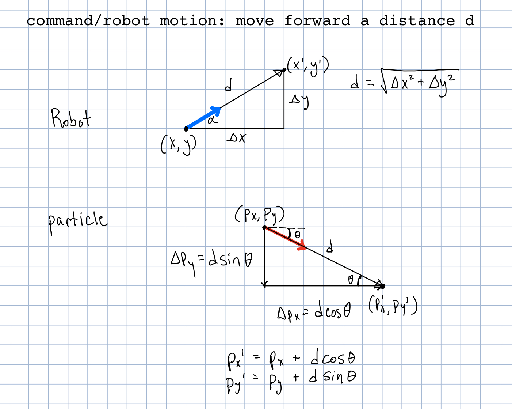

# particle_filter_project

__Team Members: Li Arditi and Victoria Villalba__

## Implementation Plan (initial)

* initialize particle cloud (`initialize_particle_cloud()`)
  * plan: create Particle() instance and assign pose values with a random number generator. We will be setting values for the Pose msg parameters Pose.position.x (range being the width of the map), Pose.position.y (range being height of map), Pose.orientation.z (range 0-360 in radians). Put these Particle() instances in an array
  * testing: run the vizualize_particles.launch to see if particle distribution looks appropriate

* update position of particles based on robot movement (`update_particles_with_motion_model()`)
  * plan: Loop through the particle cloud and calculate and store/update Pose values for the particle based on robot movement. 
  * testing: run visualize_particles.launch to see of the particles are actively moving according to the robot's movement.

* compute importance weights (`update_particle_weights_with_measurement_model()`)
  * plan: First we need to calculate the theoretical sensor measurements for each particle using the room map, then we can compare theoretical x,y,theta with actual robot scan data. Then use the weight equation, so take the inverse of the sums of differences in x,y,theta
  * testing: take a few particles and manually calculate the data to see if it matches up.

* normalize particles' importance weights (`normalize_particles()`)
  * plan: First we need to loop through the particle important weights to find the min and max values. Then to calculate normalized value, use the equation x_normalized = (x - x_min)/(x_max - x_min) [or is there a built-in or math function?]
  * testing: can be tested like the previous bullet, take a few and make sure the results match up. Or check to see if the highest normalization values are with particles that have similar information to the robot's scan data.

* resample (`resample_particles()`)
  * plan: use the `draw_random_sample(choices, probabilities)` function provided where choices is a list of the particles and probabilities are the normalized weights
  * testing: run visualize_particles.launch to see if particles are more concentrated, and more concentrated at areas that the robot could possibly be in.

* update estimated pose of robot (`update_estimated_robot_pose()`)
  * plan: update the estimated pose by taking the previous weights and estimates and adding the weights and probabilities that were just calculated. Taking the previous data and the current data will narrow down the location of the robot.
  * testing: see if the estimate is closer to the actual location than it was previously.

* incorporate noise into particle filter
  * Once the robot moves and we get the scan measurements, we can take multiple sensor measurements for the same position and average the measurements

## Timeline

* Mon. Feb 1: have most of if not all of initializing cloud and normalize weights done

* Wed Feb 3: start update particle position based on robot movement and update weights

* Sat Feb 5: start resample particles and update estimated robot position

* Mon. Feb 8: have code finished; give time to clean-up code/comments and finalize write-up

* work on write-up throughout/once a function is complete

## Writeup

### Objective

The goal of this project is to implement the particle filter algorithm to localize the position and orientation of a robot in an environment (in this case, a room/house). In this implementation of Monte Carlo localization it is assumed that the robot has a map of its environment. 

 We create a large number of particles and compare the relative surroundings of the particles to the robot sensor data and then weight the particles to get a higher amount of more accurate particles when resampling. Repeating this process will gather all the particles at or near the robot and help us determine the location.

### Description

The implementation of this particle filter starts with creating many random guesses (particles) for the possible position and orientation (`Pose()`) of the robot. When the robot moves each particle's Pose is updated to reflect the change in position and orientation of the robot. Then based on the robot's laser scan data and the hypothetical laser scan data that would be recorded from the particle's position and orientation, an importance weight is calculated for each particle based on how similar the said data are. A simplified likelihood field for range finders model is used to calculate the particle weights. A larger weight indicates the particle is a more accurate estimate of the robot's actual position and orientation and therefore will have a higher probability of being selected during resampling. Resampling involves updating the particle cloud by creating a random sample of particles based on the normalized weights of the particles. Then position and orientation values for all the particles in the updated particle cloud are averaged to estimate the robot's actual location and orientation. Updating each particle's Pose based on robot movement, calculating importance weights, normalizing particle weights, and resampling is repeated until all the particles are localized around (hopefully) the robot's actual location.

### The Code 

__Movement__

  * _Code Location:_ Using the movement of the robot to update the position and orientation of each particle is done in the function `update_particles_with_motion_model(self)` (lines 387-409)

  * _Code Description:_ This function moves all the particles the same way the robot moved by taking the last odom measurement of the robot and subtracting it from the current odom measurement of the robot's position and orientation. Then those changes are applied to every particle in the particle cloud by adding the changes to the old positions and orientations. [side note: the change in x and change in y for the particle were calculated such that it reflected the robot's overall motion (not just the robot's change in x and change in y). See diagram below.]

  

  
  

__Computation of Importance Weights__

  * _Code Location:_ The function `update_particle_weights_with_measurement_model(self, data)`  implements the likelihood field algorithm to calculate importance weights (lines 350-381). That function calls `get_closest_obstacle_distance(self, x, y)` from `likelihood_field.py` and a helper function`compute_prob_zero_centered_gaussian(dist, sd)` (line 56). After the function to update particle weights is called, `normalize_particles(self)` (lines 199-205) is called to normalize the weights. 

  * _Code Description:_ Once each particle's Pose is updated based on the robot's movement each particle's importance weight is calculated using the likelihood field for range finders algorithm. This involves taking the robot's current sensor measurements, and for each particle translate and rotate the scan to align with the particle's position and orientation. Then for each measurement end point the minimum distance to the nearest obstacle is calculated and multiplied to the total weight for the particle. Since  it would be computationally intensive to do this for all 360 sensor measurements, only some angle measurements were used (from trial and error an interval of 45 degrees was sufficient). Lastly, if for a given angle the sensor did not detect anything within its range, then sensor measurement was ignored. Similarly, if an end point is outside the bounds of the map, then the the probability is set to a very small number.

__Resampling__

  * _Code Location:_ Resampling is handled in the function `resample_particles(self)` (lines 231-245). This function calls on a helper function `draw_random_sample(choices, probabilities, n)`(line 39).

  * _Code Description:_ `resample_particles` makes a list of all the weights to use them as the `probabilities` input for the `draw_random_sample` function. The function `draw_random_sample` is used to create a new particle cloud according to the weights. This new particle cloud replaces the old particle cloud.

### Challenges

Initially it was a challenge to initialize the particle field. One reason was because I had never used quaternions to represent orientation. The other reason was because I didn't realize the OccupancyGrid map scale and origin was different from the odometry/Pose scale and origin. After a lot of confusion and trial and error and googling I eventually understood how things worked (at least well enough to initialize the particle cloud). A more general challenge was finding the balance between testing with enough particles for the importance weight calculation to work and testing with few enough particles to be able to look at print statements. This was mainly an issue when trying to get the `update_particle_weights_with_measurement_model` function to work. I started with using only 10 particles since it was easier to keep track of the different particles. However, I eventually realized that it wasn't my code/implementation of the likelihood field algorithm that was incorrect; it was the number of particles in the particle cloud that was throwing things off. That was because the probabilities/weights for each particle ended up being so small since the 10 particles were being evenly distributed across the whole map. Once the number of particles was increased the next issue was where the particles were getting localized. At that time noise wasn't included in order to simplify things, so hoping it would help noise was accounted for when the particle Poses were updated. That surprisingly helped a lot, but there were still some cases when the particle cloud localized very far from the robot's actual location. Pouya suggested testing the particle filter when the robot is placed inside the middle/small room. That worked very well, so the errors in localization outside the small room were most likely because there are locations of the map that "look" very similar. Increasing the number of particles and decreasing the number of sensor measurements used for the likelihood field model (i.e. increasing the angle interval/step from 10 to 45) increased the accuracy of localization. 

(Li notes: i found myself screaming "where the fuck are my particles!?" a lot)

### Future Work

This particle filter seems to work pretty well. However, as mentioned above in the **Challenges** section sometimes the particle filter incorrectly localized the particles if the location "looked" similar to other locations throughout the map. Although incorrect locations should theoretically get eliminated as the robot moves around more and gets more information, sometimes the particles were localized before new, differentiating data could be processed. Therefore, future work could include figuring out how to better deal with locations that "look" the same. One could potentially enhance the code by having a way to "override" the particle localization if new data doesn't match what is expected in the current localization. The linear and angular movement threshold and wait times could also probably be tweaked to decrease the likelihood of incorrect localizations. In addition, another solution could be to have the robot explore the environment on its own so it can move in a way that would help differentiate similar locations. 

### Takeaways

* expect to be doing a lot of trial and error
  * There were many times I didn't know why the code wasn't working Debugging involved changing one thing and printing results to see how/if anything changed. Also you needed to use trial and error to adjust numbers such as `num_particles`, the probability to add/set for exceptions in the likelihood field model implementation, and the step for which sensor angle measurements to use (in `update_particle_weights_with_measurement_model(self, data)`)

* taking into account noise can be the factor that makes the implementation work
  * When I (Li) was first writing the code I wasn't including noise, just to make things simpler. When I got to a working implementation of the particle filter it was still a bit off. Then I took into account noise (even though I didn't think that was the problem) and it ended up being what my implementation needed in order to work better

* [something bout it being a partner project/communication]
  * 

### Visualizations

## Image of initialized particle cloud

 

## GIFs of particle filter

 

 

 

